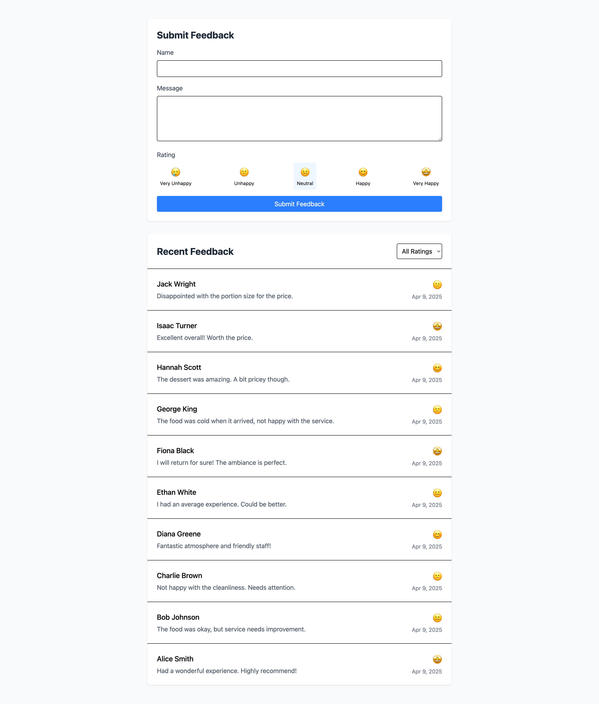
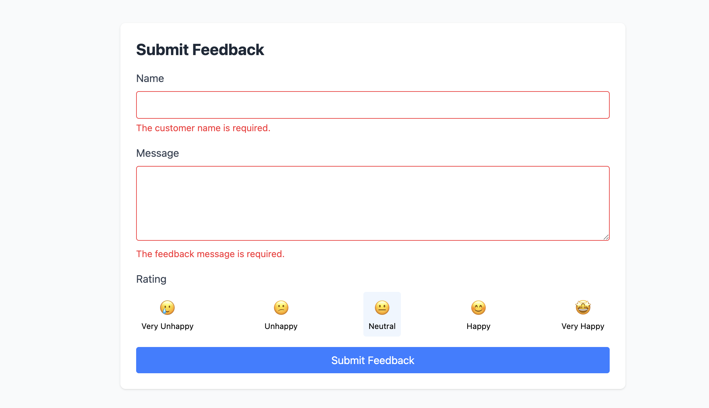
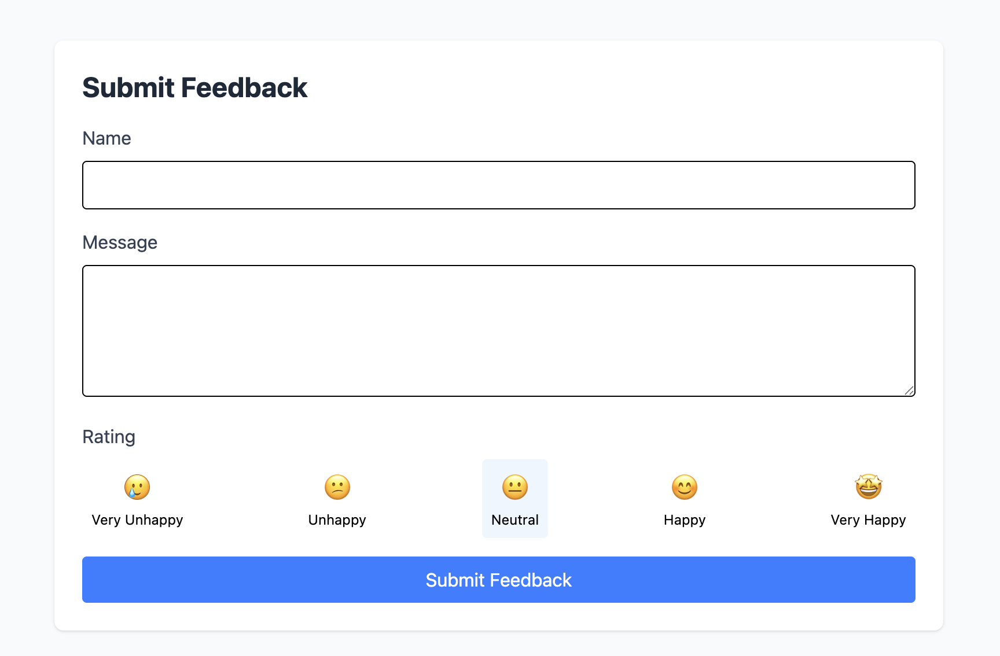

# Customer Feedback App

## Overview
This project is a full-stack application built using Laravel for the backend and React for the frontend. The application allows customers to submit feedback, view submitted feedback, and filter feedback by rating. The project demonstrates API development, form validation, data handling, and frontend display using modern web development practices.

## Demo Site Link
[Customer Feedback App Demo](https://customer-feedback.neoztech.com/)

## Technologies Used
- **Backend**: Laravel (PHP)
- **Frontend**: React (JavaScript)
- **Database**: MySQL
- **Other Tools**: 
  - TailwindCSS for styling
  - Vite for asset bundling

## Installation Instructions

### Backend (Laravel)
1. Clone the repository:
    ```bash
    git clone <repository-url>
    cd <laravel-folder-name>
    ```

2. Install dependencies:
    ```bash
    composer install
    ```

3. Set up environment variables:
    - Copy `.env.example` to `.env`:
      ```bash
      cp .env.example .env
      ```
    - Configure database credentials in `.env`.

4. Run migrations:
    ```bash
    php artisan migrate
    ```

5. Start the Laravel server:
    ```bash
    php artisan serve
    ```

### Frontend (React)
1. Navigate to the project folder:
    ```bash
    cd <react-folder-name>
    ```

2. Install dependencies:
    ```bash
    npm install
    ```

3. Start the development server:
    ```bash
    npm run dev
    ```

## Features
- **Feedback submission with name, message, and rating**: Customers can submit feedback through a form.
- **Validation on both frontend and backend**: Ensures the feedback form is correctly filled out before submission.
- **API endpoints to fetch and store feedback**: Backend endpoints to store and retrieve feedback.
- **Feedback listing with real-time updates**: Displays the 10 most recent feedback entries in a table, with updates shown dynamically.
- **Basic component-based React structure with Vite**: A modular and scalable structure for React components.

## Assumptions
- Ratings are integers between 1 and 5.
- All feedback entries include a `customer_name`, `message`, and `rating`.
- The app assumes a single user system (no authentication required).

## Edge Cases Considered
- **Empty form field prevention**: Users cannot submit empty feedback.
- **Client-side and server-side validation**: Validation occurs both on the frontend (React) and the backend (Laravel).
- **Proper error handling for API failures**: Errors are properly caught and displayed if API requests fail.
- **Missing or invalid rating entries are rejected**: Feedback with an invalid rating is not accepted.

## Potential Improvements with More Time
- **Implement pagination and search/filter for feedback**: Adding pagination or search functionality would improve user experience when dealing with large datasets.
- **Improve UI with animations and better design**: Enhancing the UI with animations, better layout, and UX improvements would make the app more user-friendly.
- **Testcase addition**: Implementing unit and integration tests for both frontend and backend would help ensure the stability and correctness of the application.

## How to Contribute
Feel free to fork this repository and submit pull requests for improvements or new features.

## Screenshots

Below are some screenshots showcasing the functionality of the Customer Feedback App:


